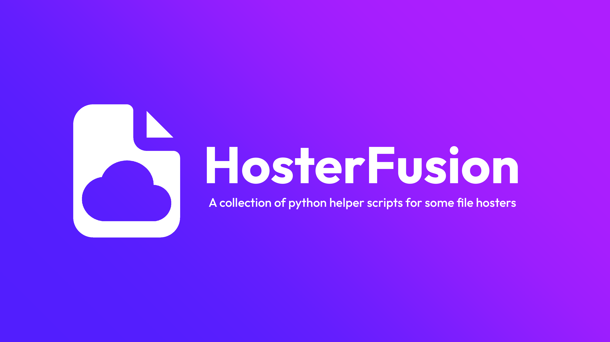

---
>**INFO**
>
>I will try to activly update this repo on changes
>
>If you encounter any error, ask under Issues or search before asking

**Full Setup**

Still WIP, only one script at a time

## Already made Scripts


**Still WIP**

The Downloader is able to get a direct downloadlink for your downloadmanagers or can directly download a list of mods (specififed in a text file) using curl 8or any other cli downloader).

**Features**
- [x] Bugfixing (Problems with Seleniums Element Finder)
- [x] Time Optimizing
- [x] Downloading of required Mods (Automatic)
- [ ] Building to Binary
- [ ] GUI
- [ ] (Premium Support (I dont have one ;-))

---

Get direct download links from fuckingfast.co for your Download Manager

**Installation**

*Global*
```bash
  git clone https://github.com/fruhansen/HosterFusion/
  cd HosterFusion/fuckingfast.co/

  #Install requirements
  pip install -r requirements.txt
```

*Virtual Enviroment*
```bash
  git clone https://github.com/fruhansen/HosterFusion/
  cd HosterFusion/fuckingfast.co/

  #Create venv
  python -m venv venv
  #activate
  venv\Scripts\activate

  #Install requirements in venv
  pip install -r requirements.txt
```
Basic Usage:
```bash
  python app.py -f <listfilepath> <-s (for saving to txt)
```
